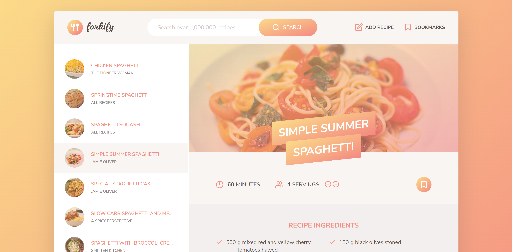

# Forkify

A recipe search application which fetches data from the forkify API (https://forkify-api.herokuapp.com/), and allows users to search for, bookmark, and add personal recipes.

## Link

Visit the website here: https://forkify-nickm.netlify.app

## Screenshots

 

 

 

 

 

## Description

This application is the final project for Jonas Schmedtmann's Udemy JavaScript course. I practiced using Model-view-controller (MVC) programming architecture, fetch requests, DRY code, refactoring, and various web APIs (virtual DOM) to bring about a smooth and fun user experience.

## Functionality

Users can type their sought-after recipes in the search bar near the top of the page. Doing so will populate the preview view on the left side of the page with recipes, from which users can click on any of the recipes to load an image and more details about the recipe. Note that the preview view lists ten recipes at a time; however, pagination allows the user to access more recipes.

Upon clicking on a recipe, users are presented with an image of the cooked meal, it's name, the approximate time it takes to cook it, and the serving size. Note that the serving size can be manipulated, allowing users to increase or decrease the value thereby changing the number of recipe ingredients needed to cook the meal. Users will also find an ingredients list along with a link to the website where the recipe originated for more detailed cooking instructions.

Users can also click the bookmark button to save the recipe to the bookmark panel located near the top of the page. These bookmarks are stored in local storage and can be accessed with a click of a button. Of course, un-bookmarking is as simple as clicking the bookmark button again.

Finally, users have the ability to add their own personal recipes. These recipes are automatically added to their list of recipes and to their bookmarks upon successfully creating them. An icon is also added to the UI to signify it was created personally. Users can upload an image of their meal, where it came from (if it came from a different website), a title, publisher, prep time, servings, and up to six different ingredients. Please note that the format for adding ingredients must follow the placeholder convention.

## Technology

HTML
 
CSS & SCSS
 
JavaScript
 
MVC architecture
 
forkify API (main recipe database)
 
fracty (for converting decimals to fractions)
 
Parcel

## Questions:

Feel free to contact me at mully7773@gmail.com if you have any questions.  
You can view more of my projects at https://github.com/Mully7773.
